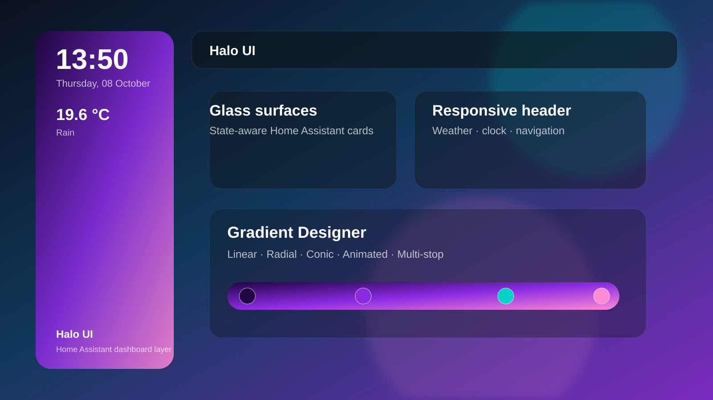
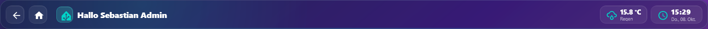
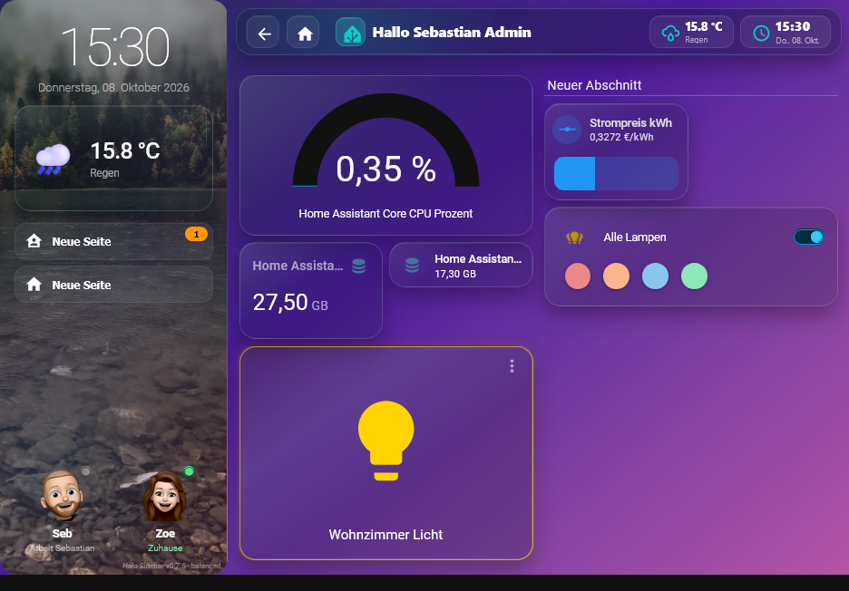

# Halo UI for Home Assistant



**Halo UI** is a modular visual layer for Home Assistant dashboards. It adds a configurable sidebar, header, animated backgrounds, glass surfaces, responsive behavior and state-aware styling while keeping your existing Home Assistant cards and entities intact.

[](https://github.com/F250SC/halo-ui/actions/workflows/validate.yml)
[](https://github.com/F250SC/halo-ui/releases/latest)
[](LICENSE)
[](https://www.home-assistant.io/)

> Halo UI does **not** replace your dashboard cards. It styles and extends the dashboard around them.

## Contents

- [Highlights](#highlights)
- [Screenshots](#screenshots)
- [Quick start](#quick-start)
- [Installation](#installation)
- [Add Halo UI to a dashboard](#add-halo-ui-to-a-dashboard)
- [Main modules](#main-modules)
- [Responsive behavior](#responsive-behavior)
- [Weather videos](#weather-videos)
- [Language support](#language-support)
- [Configuration safety](#configuration-safety)
- [Updating](#updating)
- [Compatibility](#compatibility)
- [FAQ & troubleshooting](#faq--troubleshooting)
- [Current release](#current-release)
- [Project status](#project-status)
- [Support & bug reports](#support--bug-reports)
- [License](#license)

## Highlights

- **One public card:** only `custom:halo-ui` appears in the Home Assistant card picker
- **Visual configuration:** configure Halo UI without editing large YAML blocks by hand
- **Sidebar:** clock, date, weather, navigation, presence and multiple visual layouts
- **Header:** title, user greeting, weather, clock, navigation and responsive behavior
- **Animated backgrounds:** gradient, image, video and weather-aware video backgrounds
- **Gradient Designer:** multi-stop linear, radial and conic gradients with animation
- **Glass surfaces:** configurable tint, blur, opacity, border, saturation, shadow and highlight
- **State-aware styling:** separate active colors for lights, switches, media players, climate, vacuum and warnings
- **Responsive controls:** desktop, tablet and mobile behavior can be configured independently
- **Card compatibility:** works with standard Home Assistant cards and includes conservative compatibility handling for several popular custom cards
- **Presets:** quick starting points such as Halo Glass, Clear Glass, Dark Glass, Neon, Minimal and Tropical
- **Diagnostics & maintenance:** configuration export/import, module resets and runtime diagnostics
- **Languages:** German UI when Home Assistant is German; English for English and as the fallback for all other languages

## Screenshots

### Dashboard with transparent glass surfaces


### Animated gradient dashboard


### Visual presets and global design


### Gradient Designer


### Responsive header



### Mobile sidebar


### Combined responsive layout



## Quick start

1. Install Halo UI through HACS as a custom **Dashboard** repository.
2. Reload Home Assistant when prompted.
3. Edit a dashboard.
4. Add the **Halo UI** card.
5. Save the dashboard.
6. Enter dashboard edit mode and open the Halo gear button.
7. Pick a preset or configure the modules individually.

A minimal configuration is:

```yaml
footer:
  card:
    type: custom:halo-ui
    enabled: true
    target:
      mode: current_view
```

## Installation

### HACS custom repository

Halo UI is currently available through HACS as a custom repository.

1. Open **HACS** in Home Assistant.
2. Open **Custom repositories**.
3. Add:

   ```text
   https://github.com/F250SC/halo-ui
   ```

4. Select **Dashboard** as the category.
5. Add the repository.
6. Search for **Halo UI** in HACS and install it.
7. Reload the browser when Home Assistant asks you to.

HACS installs the frontend files under:

```text
/hacsfiles/halo-ui/
```

The main frontend resource is:

```text
/hacsfiles/halo-ui/halo-ui.js
```

### Migrating from a manual installation

If you previously loaded Halo UI manually from:

```text
/local/halo-ui/halo-ui.js
```

remove that old Lovelace resource after the HACS installation is complete.

Do **not** delete your optional local weather-video folder if your configuration still points to files such as:

```text
/local/halo-ui/halo_weather/sunny.mp4
```

Loading the manual resource and the HACS resource at the same time can cause duplicate custom-element registrations and unpredictable frontend behavior.

## Add Halo UI to a dashboard

The easiest method is:

1. Edit the dashboard.
2. Choose **Add card**.
3. Select **Halo UI**.
4. Save the dashboard.
5. Use the Halo gear button while the dashboard is in edit mode to open the visual configurator.

### Dashboard-wide configuration

Halo UI can work on only the current view or act as the shared design layer for an entire dashboard.

When dashboard-wide mode is used, new and existing views can inherit the shared Halo configuration while individual views can still override selected settings.

## Main modules

### Sidebar

The Halo sidebar can include:

- clock and date
- Home Assistant weather data
- navigation items
- presence/person tiles
- cards, compact rows or avatar-focused presence layouts
- glass or animated-gradient styling
- independent design settings or inheritance from the global Halo design

On smaller screens, the sidebar can be hidden or adjusted through the responsive settings.

### Header

The header can show:

- dashboard/view title
- custom text such as `Hello {user}`
- back and home buttons
- clock
- weather and temperature
- quick navigation
- compact tablet/mobile variants

Weather entities can be selected explicitly or auto-detected when possible.

### Backgrounds

Supported background modes include:

- animated gradient
- static image
- single video
- weather-aware videos

Weather-aware video mappings can be configured for conditions such as:

- sunny
- clear night
- partly cloudy
- cloudy
- rainy
- pouring
- lightning
- lightning + rain
- snowy
- fog
- windy

### Gradient Designer

Halo UI includes a visual gradient editor with:

- up to 12 color stops
- freely adjustable stop positions
- linear, radial and conic gradients
- angle/direction control
- radial/conic center positioning
- OKLab or sRGB interpolation
- reverse and evenly-distribute tools
- animated linear, radial and conic motion

The same gradient system can be used globally and by a separately styled sidebar.

### Glass surfaces

Normal Home Assistant cards can inherit a shared Halo surface design:

- surface style
- tint
- opacity
- blur
- saturation
- border color, opacity and width
- radius
- shadow strength and blur
- highlight edge

Halo also includes compatibility handling so complex custom cards can keep their own internal UI while still receiving an outer Halo frame.

### Active-state colors

Halo UI can use domain-specific colors instead of one global accent for every active entity.

Examples include:

- lights
- switches and fans
- media players
- climate heating
- climate cooling
- vacuums
- warning/problem states

Glow strength, border opacity and border width can be tuned separately.

## Responsive behavior

Halo UI has dedicated settings for desktop, tablet and mobile layouts, including:

- breakpoints
- sidebar behavior and width
- compact or hidden headers
- header height and margin
- card spacing
- section spacing

Home Assistant still controls the underlying dashboard grid and section wrapping.

### Native dashboard content alignment (new)

Under **Responsive & System → Home Assistant Dashboard-Ausrichtung**, select
**HA-Standard**, **Links**, **Mittig** or **Rechts** separately for desktop,
tablet and mobile. **Maximale Inhaltsbreite (px)** limits the width of the
aligned content on larger screens. Halo uses the existing tablet/mobile
breakpoints and does not rearrange or replace the user's cards.

All three alignment settings default to **HA-Standard** (no layout changes).
This is a CSS-only enhancement for Home Assistant's native Lovelace view
content. The behavior should be visually tested with Sections, Masonry
and Sidebar views on the Home Assistant frontend version in use.

Example dashboard-wide controller options:

```yaml
footer:
  card:
    type: custom:halo-ui
    enabled: true
    target:
      mode: dashboard
    layout:
      dashboard_alignment: center
      dashboard_tablet_alignment: center
      dashboard_mobile_alignment: native
      dashboard_max_width: 1400
```


## Weather videos

Weather videos are optional and are **not bundled** with Halo UI.

You can keep them in Home Assistant's `www` directory and reference them through `/local/`.

Example:

```yaml
weather_videos:
  sunny: /local/halo-ui/halo_weather/sunny.mp4
  cloudy: /local/halo-ui/halo_weather/cloudy.mp4
  rainy: /local/halo-ui/halo_weather/rainy.mp4
```

If a configured video is missing or cannot be loaded, Halo UI can fall back to its normal visual background behavior depending on the selected mode.

## Language support

Halo UI follows the Home Assistant frontend language.

| Home Assistant language | Halo UI |
| --- | --- |
| German | German |
| English | English |
| Any other language | English fallback |

The translation layer is centralized so more languages can be added later without restructuring the frontend.

## Configuration safety

Halo UI is designed so that its own configuration can be changed without modifying or deleting your normal Home Assistant cards.

Useful maintenance tools include:

- export complete Halo configuration as JSON
- import a saved Halo JSON configuration
- reset individual Halo modules
- reset view-specific overrides
- remove Halo UI from a dashboard without deleting normal Home Assistant cards
- runtime diagnostics

Before large changes, using the built-in export function is recommended.

## Updating

Updates installed through HACS are handled by HACS.

After an update:

1. reload the browser
2. if necessary, use a hard refresh
3. verify that only the HACS resource is loaded

For normal HACS installations the resource should be:

```text
/hacsfiles/halo-ui/halo-ui.js
```

## Compatibility

Halo UI is built for modern Home Assistant dashboards and currently targets the common Lovelace view types used by Home Assistant.

It includes compatibility logic for standard Home Assistant cards and selected popular custom cards, including examples such as Mushroom, Big Slider, RGB Light and media-control cards.

Complex custom cards are intentionally handled conservatively so Halo styling does not destroy their internal layout.

## FAQ & troubleshooting

### Halo UI does not appear in the card picker

Check that the HACS resource exists and points to:

```text
/hacsfiles/halo-ui/halo-ui.js
```

Then reload the browser. A hard refresh may be required after an update.

### I migrated from a manual installation and the UI behaves strangely

Make sure the old manual resource is removed. Do not load both of these at the same time:

```text
/local/halo-ui/halo-ui.js
/hacsfiles/halo-ui/halo-ui.js
```

Your local weather-video files can remain under `/local/halo-ui/halo_weather/`.

### The Halo gear button is missing

The Halo gear button is shown while the Home Assistant dashboard is in edit mode. Leave edit mode and the button should disappear again.

### Weather is not shown

Select a `weather.*` entity in the Halo settings or leave the field empty to allow Halo UI to auto-detect a suitable weather entity.

### A complex custom card looks wrong after enabling Halo surfaces

Use the compatibility settings and switch complex custom cards to outer-frame-only styling. This keeps the card's internal UI untouched while still allowing an outer Halo surface.

### My browser still shows the old version

Reload Home Assistant and use a hard refresh if needed. Browser and frontend resource caching can otherwise keep an older JavaScript version active temporarily.

### Are weather videos included?

No. Weather videos are intentionally optional and are not distributed with Halo UI. You can provide your own local videos and map them to weather conditions.

### Does Halo UI delete or replace my normal cards?

No. Halo UI is designed as a visual/dashboard layer. Its maintenance tools target Halo configuration, not your normal Home Assistant cards and entities.

## Current release

**v0.10.48**

Release notes:

https://github.com/F250SC/halo-ui/releases/tag/v0.10.48

## Project status

Halo UI is under active development.

The current focus is:

- stable Home Assistant integration
- polished visual configuration
- reliable responsive behavior
- safe compatibility with existing dashboards
- internationalization
- HACS distribution

Feedback and bug reports are welcome through GitHub Issues.

## Support & bug reports

If something behaves unexpectedly, please include:

- Home Assistant version
- Halo UI version
- browser/device
- dashboard view type
- whether Halo UI was installed through HACS or manually
- screenshot if useful
- relevant browser-console error if available

Open an issue here:

https://github.com/F250SC/halo-ui/issues

## License

Halo UI is released under the **MIT License**.

Copyright © 2026 Sebastian Möller.

See [LICENSE](LICENSE) for details.
