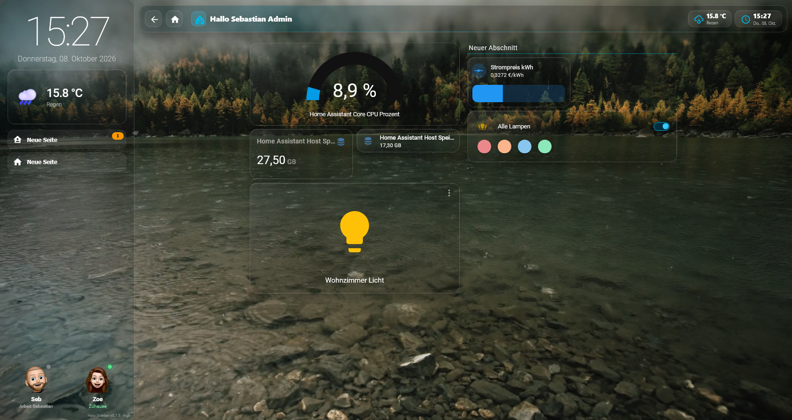
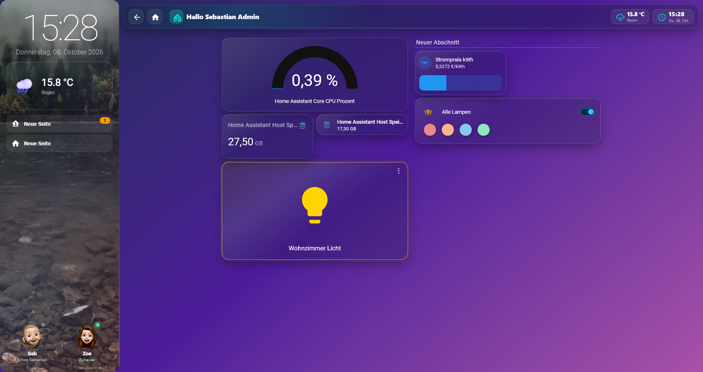
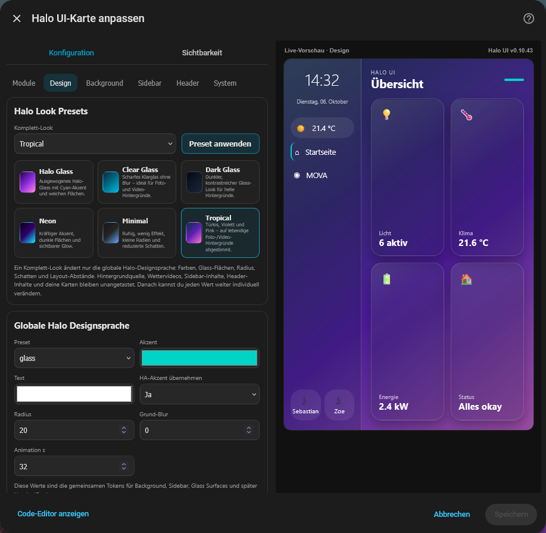
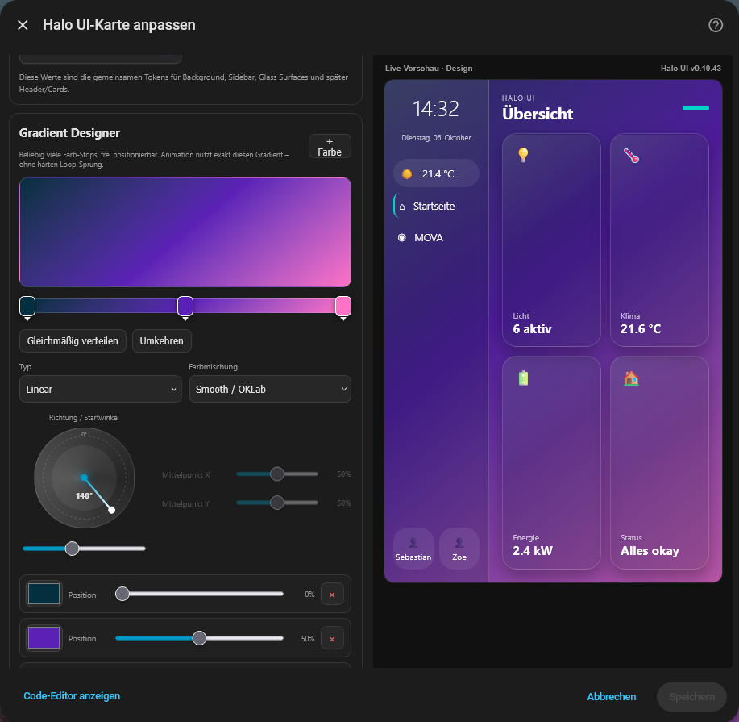
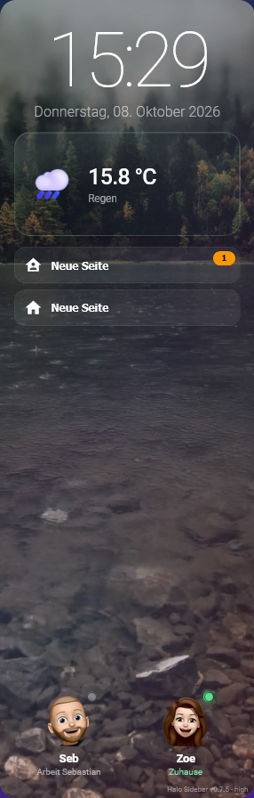

# Halo UI for Home Assistant

I built Halo UI for my own Home Assistant setup. I wanted a sidebar, weather backgrounds and a way to change the dashboard's appearance without redoing all my cards.

I've since added a configuration editor and a few other options. You can use the whole thing or just enable the parts you need. Your existing cards and entities stay in place.

[](https://github.com/F250SC/halo-ui/actions/workflows/validate.yml)
[](https://github.com/F250SC/halo-ui/releases/latest)
[](LICENSE)

## Features

Each part can be enabled separately:

- **Sidebar:** Clock, date, weather, navigation and person tiles, with a few layout options.
- **Header:** Title, greeting, navigation, clock and weather. Can be made smaller or hidden on mobile.
- **Backgrounds:** Gradients, images, videos and weather-based video switching.
- **Card styling:** Glass effects, colors, borders and shadows.
- **State colors:** Different colors for active lights, switches, media players, climate, vacuums and warnings.
- **Dashboard alignment:** Left, center or right, with separate desktop, tablet and mobile settings.
- **Presets and gradients:** A few presets and an editor for custom gradients.
- **Tools:** Import/export settings, module resets and diagnostics.

Custom cards aren't all built the same way, so some may look different with Halo styling enabled. If one breaks, try the outer-frame-only compatibility option.

## Screenshots

### Glass dashboard



### Animated gradient



### Visual configuration





### Sidebar on mobile



## Installation

Halo UI can be installed through **HACS** as a custom Dashboard repository.

1. Open HACS in Home Assistant.
2. Go to **Custom repositories**.
3. Add `https://github.com/F250SC/halo-ui` and select **Dashboard**.
4. Install **Halo UI**.
5. Reload Home Assistant (a hard refresh may be needed).

The main frontend resource is:

```text
/hacsfiles/halo-ui/halo-ui.js
```

If you've previously installed Halo UI manually using `/local/halo-ui/halo-ui.js`, remove that *old resource entry* after switching to HACS. Loading both resources can cause problems. Your own weather videos in `/local/halo-ui/halo_weather/` do not need to be deleted.

## Setup

Edit your dashboard, add the **Halo UI** card and save. Open the Halo gear button in dashboard edit mode to change the settings.

You can use Halo UI on one view or across the dashboard. Dashboard-wide settings can be overridden for individual views.

For a YAML dashboard, a minimal example is:

```yaml
footer:
  card:
    type: custom:halo-ui
    enabled: true
    target:
      mode: current_view
```

You can switch `current_view` to `dashboard` if you want the settings to apply across your dashboard.

## Layout on desktop, tablet and phone

Home Assistant still handles the card grid. Halo UI can adjust spacing, sidebar/header behavior and where the dashboard content sits.

In **Responsive & System → Home Assistant Dashboard-Ausrichtung**, you can set left, center or right alignment separately for desktop, tablet and mobile. There's also a maximum width setting. By default, Halo UI leaves HA's alignment unchanged.

For example:

```yaml
footer:
  card:
    type: custom:halo-ui
    enabled: true
    target:
      mode: dashboard
    layout:
      dashboard_alignment: center
      dashboard_tablet_alignment: center
      dashboard_mobile_alignment: native
      dashboard_max_width: 1400
```

Alignment is turned off while editing the dashboard so HA's drag-and-drop controls stay in their normal positions.

## Weather videos

You can assign videos to weather conditions such as sunny, cloudy, rainy, snowy and foggy. Halo UI switches between them based on the weather entity.

**Weather videos aren't included.** You'll need to add your own files.

Put the MP4 files in Home Assistant's `www` directory (accessible as `/local/`) and set their paths in Halo UI. For example:

```yaml
weather_videos:
  sunny: /local/halo-ui/halo_weather/sunny.mp4
  cloudy: /local/halo-ui/halo_weather/cloudy.mp4
  rainy: /local/halo-ui/halo_weather/rainy.mp4
```

Videos are centered when cropped to fit the screen or sidebar. Short, smoothly looping MP4 files work best. Check the license if you're using downloaded footage.

If a file doesn't load, the result depends on your background and fallback settings.

## Languages

The configurator follows the Home Assistant language for German and English. Other languages currently fall back to English.

## Updating and backups

HACS handles updates. After updating, reload the browser; if an older version still appears, try a hard refresh.

You can export your Halo configuration before changing things. The editor also has module resets and an option to remove Halo UI without deleting your existing cards.

## Troubleshooting

**I can't find the Halo UI card.** Check that the HACS installation completed and the `/hacsfiles/halo-ui/halo-ui.js` resource is available. Then reload the browser.

**The gear button disappeared.** The configuration button is intended to appear in Home Assistant's dashboard edit mode, not during normal use.

**My weather isn't showing.** Choose a suitable `weather.*` entity in the settings, or try the automatic detection.

**A custom card looks strange.** Try the compatibility options and outer-frame-only styling for complex cards, so Halo does not interfere with the card's internal controls.

**The old interface still appears after updating.** Check that the old manual resource isn't loaded alongside the HACS resource, then hard-refresh your browser.

Home Assistant updates can change how some of this works. If something stops working, please include your HA version, Halo UI version, view type and a screenshot in the issue.

## Releases and feedback

Changes are listed under [Releases](https://github.com/F250SC/halo-ui/releases/latest).

If you've found a bug or want to suggest something, [open an issue](https://github.com/F250SC/halo-ui/issues). I'm working on this in my spare time, so I can't promise a quick fix for everything.

## License

Halo UI is released under the [MIT License](LICENSE).

Copyright © 2026 Sebastian Möller.
